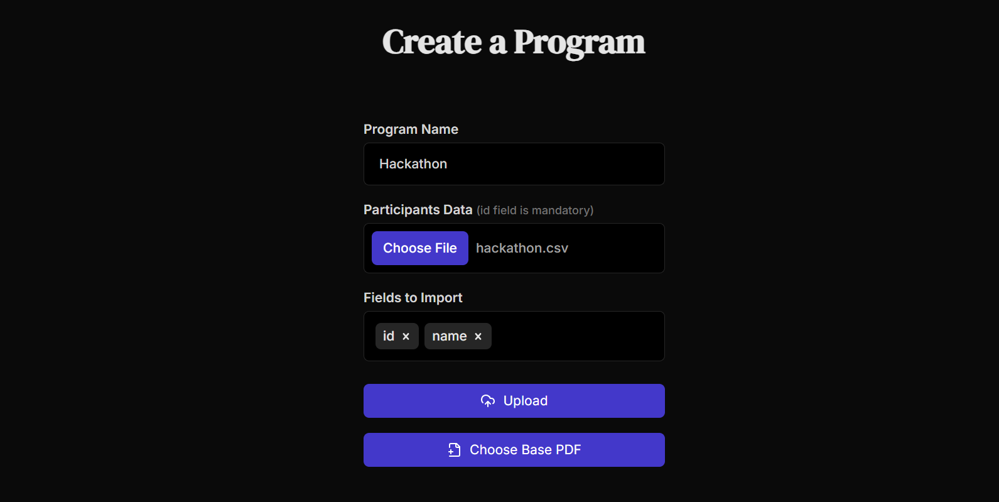
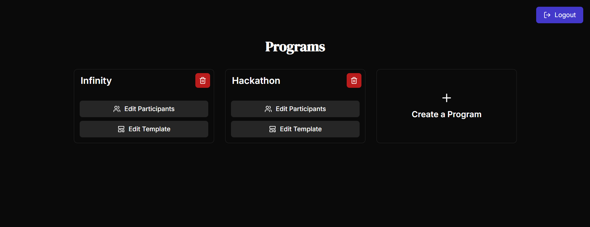

<h1 align="center">CertifiCat 😸</h1>
<p align="center">A Self-Hosted Certificate Generation and Management Solution for Event Organisers</p>

### But How is it any different from other certificate generators?
- CertifiCat is a **self-hosted** solution, which means you can host it on your own server under your own domain. 
- Unlike others, CertifiCat lets you bring **your own templates** to generate certificates for multiple events.
- Not just a generator! CertifiCat comes with an **Admin Panel** and a user facing **Download Page** to both manage and distribute certificates.
- CertifiCat is **open-source** and **free** to use.
- And most importantly, **cats**...🧶🐈

### Screenshots

|  |  |  |
| --- | --- | --- |
| Claim Certificate | Create Event | Admin Dashboard |


## Getting Started

clone the repository:
```bash
git clone https://github.com/arnav-kr/CertifiCat.git
cd CertifiCat
```

Install the dependencies:
```bash
yarn install
```

Build the project:
```bash
yarn build
```

Start the server:
```bash
yarn start
```

Server will start at [localhost:3000](http://localhost:3000)

## Usage

### Pre-requisites
CertifiCat uses [firebase](https://firebase.google.com/) for authentication, database and storage. You need to create a firebase project with blaze plan and get the firebase config.

You can get the firebase config from the firebase console.

#### Project Setup
Create a `.env.local` file in the root of the project and add the following environment variables:
```bash
NEXT_PUBLIC_FIREBASE_API_KEY=
NEXT_PUBLIC_FIREBASE_AUTH_DOMAIN=
NEXT_PUBLIC_FIREBASE_PROJECT_ID=
NEXT_PUBLIC_FIREBASE_STORAGE_BUCKET=
NEXT_PUBLIC_FIREBASE_APP_ID=
```

#### Authentication
enable email/password authentication in firebase console and create a user. This user will be the admin of the application.

> [!NOTE]
> Disable the sign-up method in firebase console to prevent others from signing up.

#### Firestore and Storage
enable firestore and storage in firebase console.

Now your application is ready to use.

### Admin Panel
Admin Panel is where you can manage your certificates and events. You can add new events, upload templates, and generate certificates.

Admin Panel will be available at [localhost:3000/admin/dashboard](http://localhost:3000/admin/dashboard)


### Download Page
Download Page is where users can download their certificates. They can enter their certificate code or user ids and download their certificate.

The homepage itself is the download page and will be available at [localhost:3000](http://localhost:3000)

## Development
clone the repository:
```bash
git clone https://github.com/arnav-kr/CertifiCat.git
cd CertifiCat
```

Install the dependencies:
```bash
yarn install
```

start the development server:
```bash
yarn dev
```

Dev server will start at [localhost:3000](http://localhost:3000)

## License
<!-- AGPL-3.0 -->
This project is licensed under the AGPL-3.0 License - see the [LICENSE](LICENSE) file for details.

## Contributors
